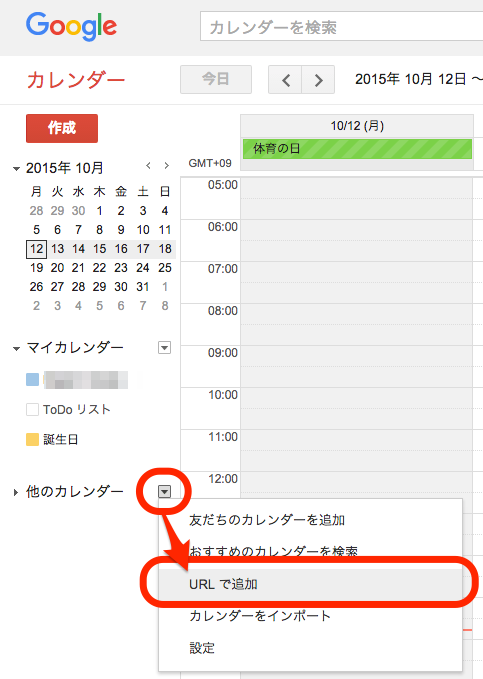
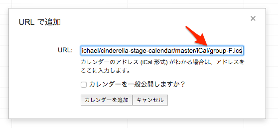
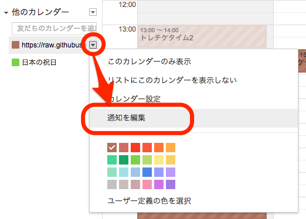

cinderella-stage-calendar
==========================
日付からデレステのトレチケタイムを導き出します。iCal形式のファイルも置いてます。

## CAUTION

- 非公式のカレンダーです。間違っても公式の運営さんに文句をいわないように
- 間違いがあっても何も保証できません。仕様変更などの情報があればissueで寄せて頂ければ幸いです

## For Consumers
例として、Googleカレンダーに登録する手順を載せておきます。

1. グループ別にiCalファイルが分かれているので、自分のグループのURLをコピーしておいてください。

- グループA https://raw.githubusercontent.com/kuronekomichael/cinderella-stage-calendar/master/iCal/group-A.ics
- グループB https://raw.githubusercontent.com/kuronekomichael/cinderella-stage-calendar/master/iCal/group-B.ics
- グループC https://raw.githubusercontent.com/kuronekomichael/cinderella-stage-calendar/master/iCal/group-C.ics
- グループD https://raw.githubusercontent.com/kuronekomichael/cinderella-stage-calendar/master/iCal/group-D.ics
- グループE https://raw.githubusercontent.com/kuronekomichael/cinderella-stage-calendar/master/iCal/group-E.ics
- グループF https://raw.githubusercontent.com/kuronekomichael/cinderella-stage-calendar/master/iCal/group-F.ics
- グループG https://raw.githubusercontent.com/kuronekomichael/cinderella-stage-calendar/master/iCal/group-G.ics
- グループH https://raw.githubusercontent.com/kuronekomichael/cinderella-stage-calendar/master/iCal/group-H.ics

2. Googleカレンダーを開いて、**[他のカレンダー]**メニューから**[URLで追加]**を開きます



3. 1.でメモしてURLを入力して、**[カレンダーを追加]**します



4. お好みでカレンダーの色を変えたり、通知を編集したりしてみてください



## For Developers

### Installation

```bash
$ npm install cinderella-stage-calendar
```

```javascript
var TicketCalendar = require('cinderella-stage-calendar');
var tCal = new TicketCalendar(TicketCalendar.GROUP_A);
var times = tCal.getTrainingTicketTimesByDate(new Date('2015-10-1'));
console.log(times);

//[ Thu Oct 01 2015 09:00:00 GMT+0900 (JST),
//  Thu Oct 01 2015 13:00:00 GMT+0900 (JST),
//  Thu Oct 01 2015 20:00:00 GMT+0900 (JST) ]
```

## References

- 公式サイト「アイドルマスター シンデレラガールズ スターライトステージ」  
http://cinderella.idolmaster.jp/sl-stage/
- アイマス デレステ攻略まとめwiki【アイドルマスター シンデレラガールズ スターライトステージ】  
http://imascg-slstage-wiki.gamerch.com/%E3%83%88%E3%83%AC%E3%83%81%E3%82%B1%E3%82%BF%E3%82%A4%E3%83%A0
